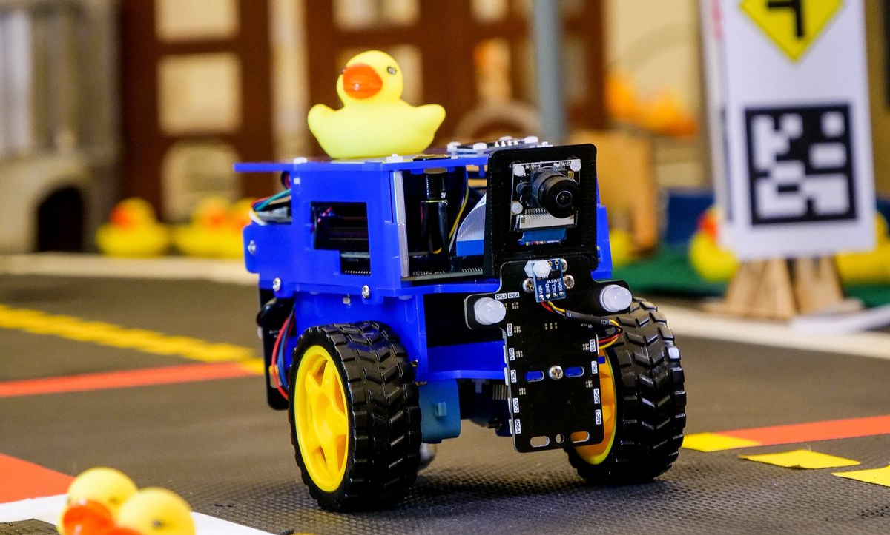

# RL in Depth

Welcome to the Reinforcement Learning (RL) workshop! In this class, you will embark on an exciting three-day journey to deepen your understanding of RL by applying advanced concepts to a real-world robotics challenge. Our goal is to design and deploy an RL-based solution that commands a two-wheeled robot, the **Duckiebot**, to navigate a real road environment successfully. This project will challenge your creativity, problem-solving skills, and ability to deploy solutions that consider the constraints of embedded systems on the robot.

  

Through this hands-on experience, you will gain practical insights into:
- Refining your understanding of Reinforcement Learning.
- Designing an RL agent suitable for controlling a two-wheeled robot.
- Deploying and testing your solution on hardware, addressing real-world constraints such as sensor limitations, latency, and computational resources.

## Organization

### Day 1: Discovery and Exploration
- **Morning**: Students will familiarize themselves with the simulator that models the Duckiebot and train an RL agent using the provided instructions in [duckiesim.md](duckiesim/duckiesim.md) file. This file explains how to set up the environment and guides students through the first steps of training.
- **Afternoon**: Students will first get hands-on experience with the real Duckiebots. Then, they will form groups to brainstorm and develop a solution for automating the robot using RL. The entire process of deploying RL in the real world is detailed in [duckiereal.md](duckiereal/duckiereal.md) file.

### Days 2 and 3: Development and Competition
- Over the next two days, the focus will shift to the development and refinement of the RL-based solution. Students will test their agents, improve their models, and prepare for the final competition.

### Competition
At the end of Day 3, the competition will take place on a **circuit unknown to the students**. The objective is to **finish the circuit in minimal time**. The group with the best-performing agent will earn a grade of 20, while others will "strive harder next year" (humor).

## Course Schedule

Here is the planned schedule for the three days:

| **Day** | **Time**   | **Session**                                   | **Key Goals**                                      |
|---------|------------|-----------------------------------------------|--------------------------------------------------|
| Day 1   | 08:00-10:00 | Getting started with codebase           | Installation + Manual Control          |
|         | 10:00-12:00 | RL Environment + Reward shaping   | Prepare the environment for training   |
|         | 13:00-15:00 | Handling real robots | Make real robots work  (harder than it looks)                     |
|         | 15:00-17:00 | Project presentation and Group set-up        |      The competition begins        |
| Day 2   | 08:00-10:00 | Reading group                        | Understand how to solve the problem                      |
|         | 10:00-12:00 | Implementation \& Debbug        | Make it work  |
|         | 13:00-15:00 |  Implementation \& Debbug        | Make it work  |
|         | 15:00-17:00 |  Implementation \& Debbug        | Make it work  |       
| Day 3   | 08:00-10:00 |  Implementation \& Debbug        | Make it work  |                 
|         | 10:00-12:00 |  Implementation \& Debbug        | Make it work  |
|         | 13:00-15:00 | Get ready for the competition                    | Get ready for the competition     |
|         | 15:00-17:00 | Run on various circuits  + Feedback   | Evaluation            |

## INSTALLATION:

### 0. Create the conda environment:
`conda env create -f environment.yaml`

### 1. Activate the new conda environment:
`conda activate duckietownrl`

## UNINSTALLATION:

### To remove the conda environment:
`conda remove -n duckietownrl --all`

## SIMULATOR:
### For playing with the keyboard:
`./manual_control.py`

### For playing with the joystick:
`./joystick_control.py`

## TRAINING A MODEL WITH SAC:
The following script can run several environments in parallel and collect experience in the same Replay Buffer

### For a standard version:
`python duckietownrl/parallel_training.py`

### For imitation learning with the joystick:
Press the j key to activate and deactivate the joystick control. By default, the joystick is activated, and you have to move with it to collect a new experience; otherwise, it returns, and no steps are done. Once you finish manually controlling, press the j key to let the agent train independently.

`python duckietownrl/parallel_training_imitation_learning.py`

## TO EVALUATE A MODEL:
Remember to specify the path for your model in the script.

`python duckietownrl/evaluate.py`
